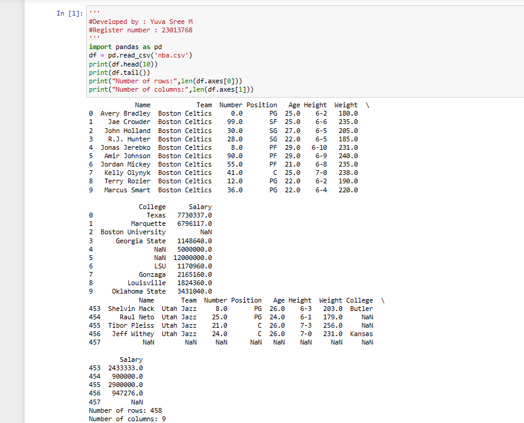

# Read-from-CSV

## AIM:

## ALGORITHM:
### Step 1:import pandas as pd

### Step 2:Read the CSV file using read_csv method

### Step 3:Use head and tail method to get the required contents from the file

### Step 4:Use len() method to get the number of rows and columns

### Step 5:Print the program


## PROGRAM:
```

'''
#Developed by : Yuva Sree M
#Register number : 23013768
'''
import pandas as pd
df = pd.read_csv('nba.csv')
print(df.head(10))
print(df.tail())
print("Number of rows:",len(df.axes[0]))
print("Number of columns:",len(df.axes[1]))

```
## OUTPUT:



## RESULT:
completed
